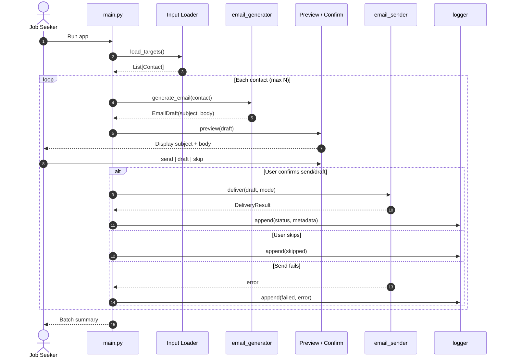
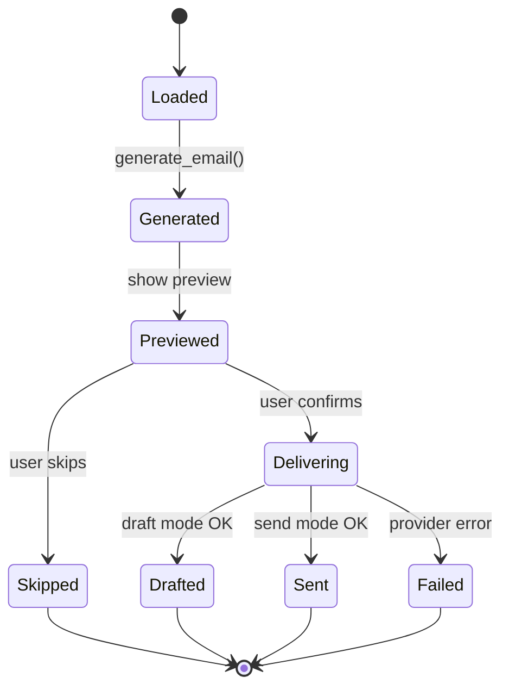
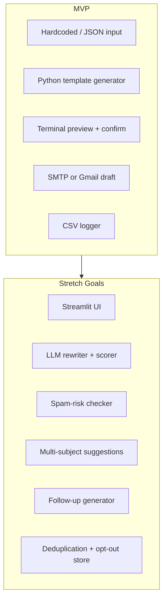

# Architecture: The Closer — Cold Email Writer + Send Bot

This document describes the system architecture for **The Closer**, derived from [problemStatement.md](./problemStatement.md). It is designed for a live, demo-friendly Python build in Cursor: simple modules, clear boundaries, and safety-by-default behavior.

---

## 1. Architecture Goals

| Goal | How the architecture supports it |
|------|----------------------------------|
| Explainable in a live demo | Few modules, linear pipeline, no hidden side effects |
| Safe by default | Draft/dry-run first, human confirmation gate, volume caps |
| Modular | Generation, preview, send, and log are separate concerns |
| Extensible | Optional LLM, UI, and providers plug in behind interfaces |
| Auditable | Every attempt logged with status and errors |

**Non-goals for MVP:** bulk sending, unattended automation, multi-tenant SaaS, or a production-grade email platform.

---

## 2. System Context

The system sits between a **job seeker** (operator) and **Gmail or an SMTP provider**. It does not scrape job boards or discover contacts in MVP scope—it consumes pre-prepared outreach targets.

```mermaid
C4Context
    title System Context — The Closer

    Person(seeker, "Job Seeker", "Reviews and approves each email")
    System(closer, "The Closer", "Generates, previews, drafts/sends outreach")
    System_Ext(gmail, "Gmail / SMTP", "Delivers or stores drafts")
    System_Ext(input, "Local Files", "contacts.json, jobs.csv")
    System_Ext(log, "outreach_log.csv", "Audit trail")

  seeker --> closer : runs CLI, confirms send/skip
  closer --> input : loads targets
  closer --> gmail : draft or send
  closer --> log : append entries
  seeker --> gmail : verifies Sent/Drafts folder
```

---

## 3. High-Level Architecture

The application is a **single-process CLI pipeline** with four core capabilities orchestrated by a thin entry point.

```text
┌─────────────────────────────────────────────────────────────────────────┐
│                              main.py (Orchestrator)                      │
│  load config → load targets → for each target: pipeline → exit summary │
└─────────────────────────────────────────────────────────────────────────┘
         │              │              │              │
         ▼              ▼              ▼              ▼
┌──────────────┐ ┌──────────────┐ ┌──────────────┐ ┌──────────────┐
│ Input Loader │ │Email Generator│ │   Preview    │ │ Email Sender │
│ (contacts)   │ │  (template)   │ │  + Confirm   │ │ SMTP / API   │
└──────────────┘ └──────────────┘ └──────────────┘ └──────────────┘
         │              │              │              │
         └──────────────┴──────────────┴──────────────┘
                                    │
                                    ▼
                          ┌──────────────┐
                          │    Logger    │
                          │ outreach_log │
                          └──────────────┘
```

### 3.1 Layered View

| Layer | Responsibility | MVP modules |
|-------|----------------|-------------|
| **Presentation** | Terminal I/O, preview formatting, yes/no/skip prompts | `main.py` (inline) or `cli.py` (stretch) |
| **Application** | Per-target workflow, guardrails, batch limits | `main.py` |
| **Domain** | Contact model, email model, cold-email rules | `models.py` (optional), `email_generator.py` |
| **Infrastructure** | File I/O, SMTP/Gmail, env config | `email_sender.py`, `logger.py`, `config.py` |

---

## 4. End-to-End Data Flow

This matches the problem statement workflow:

```text
Job Listing / Contact Info
        ↓
Personalization Extraction  (validate + normalize fields)
        ↓
Cold Email Generation       (subject + body, <150 words)
        ↓
Human Review                (terminal preview + confirm)
        ↓
Draft or Send Email         (Gmail draft / SMTP send)
        ↓
Proof in Sent Folder        (operator verification + log)
```



---

## 5. Module Design

### 5.1 `main.py` — Orchestrator

**Role:** Wire the pipeline, enforce global guardrails, and own the per-contact state machine.

**Responsibilities:**

- Load configuration from environment (`.env`)
- Invoke input loader
- Iterate contacts with a **hard cap** (e.g. 5 for demo, configurable `MAX_OUTREACH_PER_RUN`)
- Call generator → preview → confirm → sender → logger in order
- Print batch summary (sent / drafted / skipped / failed counts)

**Per-contact state machine:**



**Pseudocode contract:**

```python
def run_outreach_pipeline() -> None:
    config = load_config()
    contacts = load_targets(config.input_path)
    contacts = apply_guardrails(contacts, config)

    for contact in contacts:
        draft = generate_email(contact, config)
        action = preview_and_confirm(draft)

        if action == "skip":
            log_entry(contact, draft, status="skipped")
            continue

        if config.dry_run:
            log_entry(contact, draft, status="generated")
            continue

        result = deliver_email(draft, mode=config.send_mode)
        log_entry(contact, draft, status=result.status, error=result.error)
```

---

### 5.2 Input Loader — `contacts.json` / `jobs.csv` / hardcoded list

**Role:** FR1 — load outreach targets from a simple data source.

**Implementation options (MVP → stretch):**

| Source | MVP | Notes |
|--------|-----|-------|
| Hardcoded Python list | ✓ Start here | Best for live demo Step 1 |
| `contacts.json` | ✓ | Schema matches problem statement |
| `jobs.csv` | Stretch | Map CSV columns → `Contact` |

**Suggested module:** `input_loader.py` with a single public function:

```python
def load_targets(path: str | None = None) -> list[Contact]:
    ...
```

**Validation rules (fail fast per record, skip or abort batch on critical errors):**

| Field | Required | Validation |
|-------|----------|------------|
| `recipient_email` | Yes | Valid email format |
| `company` | Yes | Non-empty |
| `role` | Yes | Non-empty |
| `candidate_name` | Yes | Non-empty |
| `candidate_background` | Yes | Non-empty; used for personalization |
| `recipient_name` | No | Default to `"there"` or `"Hi"` variant |
| `personalization_note` | No | If missing, generator uses company+role fallback |
| URLs | No | Basic URL format if present |

---

### 5.3 `email_generator.py` — Cold Email Generation

**Role:** FR2 — produce `subject` and `body` following the six-part email anatomy.

**Email anatomy mapping:**

| Section | Template variable / logic |
|---------|----------------------------|
| Subject | `f"Quick note on the {role} role"` or company-specific variant |
| Personalization hook | `personalization_note` or derived from `company` + `role` |
| Introduction | `candidate_name`, `candidate_background` |
| Value / fit | Connect background to `role` |
| One clear ask | Fixed polite CTA (chat / right person) |
| Sign-off | `candidate_name`, optional `portfolio_url` |

**Core interface:**

```python
@dataclass
class EmailDraft:
    subject: str
    body: str
    word_count: int

def generate_email(contact: Contact, config: AppConfig) -> EmailDraft:
    ...
```

**Constraints enforced in generator (not only in LLM prompt):**

- `word_count <= 150` (post-process trim or regenerate warning)
- Single ask (template enforces one CTA block)
- No invented facts: only interpolate provided fields; never hallucinate experience
- If `personalization_note` empty, require non-generic hook from `company` + `role` (guardrail flag if too generic)

**Template strategy (MVP):** deterministic Python f-string / `string.Template`.

**Stretch:** `LLMEmailGenerator` implementing the same `generate_email` interface using Groq API, with a **post-generation validator** (word count, banned phrases, no fake referral language).

---

### 5.4 Preview & Confirmation — FR3

**Role:** Human-in-the-loop gate before any provider call.

**MVP:** functions in `main.py` or `preview.py`:

```python
def preview_email(draft: EmailDraft, contact: Contact) -> None:
    # Pretty-print: company, role, recipient, subject, body, word count

def prompt_action() -> Literal["send", "draft", "skip"]:
    # "Send this email? (send/draft/skip):"
```

**Rules:**

- Never call `email_sender` without explicit user confirmation (except `DRY_RUN=true`, which skips provider entirely)
- Re-display full body on each decision
- Optional: allow `edit` stretch goal (re-prompt or open editor)

---

### 5.5 `email_sender.py` — Draft or Send

**Role:** FR4 — abstract delivery behind one interface; one provider for MVP.

**Interface:**

```python
@dataclass
class DeliveryResult:
    status: Literal["drafted", "sent", "failed"]
    provider_message_id: str | None
    error: str | None

def deliver_email(
    draft: EmailDraft,
    contact: Contact,
    config: AppConfig,
    mode: Literal["draft", "send"],
) -> DeliveryResult:
    ...
```

**Provider options:**

| Provider | Mode | MVP recommendation |
|----------|------|-------------------|
| SMTP (`smtplib`) | send | ✓ Simplest for teaching |
| Gmail API | draft + send | ✓ Safer demo (draft mode) |
| Gmail MCP | draft + send | Optional Cursor integration |
| SendGrid / Resend | send | Alternative if SMTP blocked |

**Adapter pattern:**

```text
EmailSender (protocol)
    ├── SmtpEmailSender
    ├── GmailApiEmailSender      (stretch)
    └── DryRunEmailSender        (DRY_RUN=true — no network)
```

**`DRY_RUN=true` behavior:**

- Skip network I/O
- Log as `generated` or `dry_run`
- Still run preview + confirmation for teaching flow

---

### 5.6 `logger.py` — Outreach Audit Log

**Role:** FR5 — append-only proof and debugging.

**Log file:** `outreach_log.csv`

| Column | Description |
|--------|-------------|
| `timestamp` | ISO-8601 UTC or local |
| `recipient_email` | |
| `company` | |
| `role` | |
| `subject` | |
| `status` | `generated`, `drafted`, `sent`, `skipped`, `failed` |
| `error_message` | Empty if success |
| `word_count` | Optional but useful |
| `job_url` | Optional |

**Interface:**

```python
def append_log(entry: LogEntry, path: str = "outreach_log.csv") -> None:
    ...
```

**Properties:**

- Append-only (never overwrite history)
- Create file with header if missing
- Thread-safe enough for single-process CLI (file lock optional for stretch)

---

### 5.7 `config.py` — Environment & Safety Knobs

**Role:** Centralize configuration; no secrets in code.

| Variable | Purpose | Default |
|----------|---------|---------|
| `SMTP_HOST` | SMTP server | `smtp.gmail.com` |
| `SMTP_PORT` | Port | `587` |
| `SMTP_USER` | Sender email | required for send |
| `SMTP_PASSWORD` | App password | required for send |
| `SENDER_NAME` | Display name | |
| `DRY_RUN` | Skip real delivery | `true` |
| `SEND_MODE` | `draft` or `send` | `draft` |
| `MAX_OUTREACH_PER_RUN` | Volume cap | `5` |
| `INPUT_PATH` | `contacts.json` path | optional |

Load via `python-dotenv` from `.env` (never committed).

---

## 6. Domain Model

### 6.1 `Contact` (input record)

```python
@dataclass
class Contact:
    recipient_email: str
    company: str
    role: str
    candidate_name: str
    candidate_background: str
    recipient_name: str | None = None
    job_url: str | None = None
    portfolio_url: str | None = None
    personalization_note: str | None = None
    linkedin_url: str | None = None
    resume_link: str | None = None
```

### 6.2 `EmailDraft` (generator output)

```python
@dataclass
class EmailDraft:
    subject: str
    body: str
    word_count: int
```

### 6.3 `LogEntry` (logger row)

```python
@dataclass
class LogEntry:
    timestamp: str
    recipient_email: str
    company: str
    role: str
    subject: str
    status: str
    error_message: str = ""
```

---

## 7. Safety & Ethics Architecture

Guardrails are **cross-cutting**—implemented in orchestrator + generator + config, not only documentation.

```text
┌────────────────────────────────────────────────────────────┐
│                    Safety Envelope                          │
├────────────────────────────────────────────────────────────┤
│ 1. Human review gate     → preview_and_confirm() mandatory │
│ 2. Volume cap            → MAX_OUTREACH_PER_RUN            │
│ 3. Personalization check → reject empty/generic hooks       │
│ 4. Identity binding      → SENDER_NAME / SMTP_USER match   │
│ 5. No fabrication        → template-only fields in MVP      │
│ 6. Opt-out list (stretch)→ do_not_contact.csv filter       │
│ 7. DRY_RUN default       → true in .env.example              │
└────────────────────────────────────────────────────────────┘
```

| Requirement | Implementation |
|-------------|----------------|
| Human review | FR3 blocks delivery without confirmation |
| Low volume | Cap contacts per run; demo uses 3–5 |
| Personalization | Require `candidate_background` + company/role hook |
| No deceptive identity | Send only from authenticated `SMTP_USER` |
| No fake claims | No LLM in MVP; optional validator in stretch |
| Opt-outs | `OptOutFilter` before loop (stretch) |

---

## 8. Error Handling Strategy

| Failure | Behavior | Log status |
|---------|----------|------------|
| Invalid contact row | Skip record, warn in terminal | — |
| Missing required env on send | Abort delivery for that email | `failed` |
| SMTP auth failure | Show clear message (app password hint) | `failed` |
| User skip | Continue pipeline | `skipped` |
| Word count > 150 | Warn in preview; optional block | `generated` |

**Principles:**

- Fail loud in the terminal with actionable messages
- Never silently drop a user-confirmed send
- Always write a log row for attempted outreach

---

## 9. Deployment & Runtime Model

| Aspect | Choice |
|--------|--------|
| Runtime | Python 3.10+ single process |
| Execution | `python main.py` from project root in Cursor terminal |
| State | Stateless between runs; state in `outreach_log.csv` |
| Secrets | `.env` local only |
| Dependencies | `requirements.txt` (minimal: `python-dotenv`, optional `groq`, `google-api-python-client`) |

No database, queue, or web server in MVP.

---

## 10. Repository Layout

Aligned with problem statement §12:

```text
the-closer/
│
├── main.py                 # Orchestrator + CLI loop
├── config.py               # Env loading + AppConfig
├── models.py               # Contact, EmailDraft, LogEntry (optional split)
├── input_loader.py         # JSON/CSV/hardcoded loading
├── email_generator.py      # Template-based generation + validation
├── preview.py              # Optional: preview + prompt helpers
├── email_sender.py         # SMTP / Gmail adapters + dry-run
├── logger.py               # outreach_log.csv append
├── contacts.json           # Sample input
├── outreach_log.csv        # Generated at runtime
├── .env.example
├── requirements.txt
├── README.md
└── docs/
    ├── problemStatement.md
    └── architecture.md
```

---

## 11. MVP vs Stretch Architecture



| Stretch feature | Architectural addition |
|-----------------|------------------------|
| Gmail drafts | `GmailApiEmailSender` |
| CSV upload | `input_loader.py` CSV parser |
| Streamlit UI | `ui/app.py` calls same pipeline functions |
| LLM rewriting | `LLMEmailGenerator` using Groq API + `EmailQualityValidator` |
| Quality / spam score | Post-processor plugin before preview |
| Multiple subjects | Generator returns `list[str]`, user picks in preview |
| Follow-ups | New `followup_generator.py` + log links `parent_id` |
| Deduplication | `RecipientRegistry` reading past log emails |

---

## 12. Acceptance Criteria Traceability

| Criterion | Architectural component |
|-----------|-------------------------|
| ≥5 personalized emails | `email_generator.py` + ≥5 contacts in input |
| Subject + body | `EmailDraft` |
| Company/role personalization | Template hook + `personalization_note` |
| Preview before send | `preview_and_confirm()` |
| Send or draft successfully | `email_sender.py` |
| Log each attempt | `logger.py` |
| Proof via Sent/Drafts | External Gmail verification + log `status` |

---

## 13. Demo Build Order (Implementation Sequence)

Maps to problem statement §16—this is the recommended **vertical slice** order:

1. **Sample data** — `contacts.json` with 3 records  
2. **Generator** — `generate_email()` + unit-style manual test  
3. **Preview** — print formatted draft  
4. **Confirmation** — send/draft/skip prompt  
5. **Sender** — `DryRunEmailSender` then real SMTP with `DRY_RUN`  
6. **Logger** — append every outcome  
7. **Live send** — one email to self, `DRY_RUN=false`  
8. **Proof** — Gmail Sent/Drafts screenshot + `outreach_log.csv`  

---

## 14. Testing Strategy (Lightweight)

Appropriate for a teaching repo—no heavy CI required.

| Test type | What to verify |
|-----------|----------------|
| Manual demo script | End-to-end with `DRY_RUN=true` |
| Generator snapshots | Subject/body shape, word count ≤ 150 |
| Sender mock | `DryRunEmailSender` returns success without network |
| Log integrity | Each run appends rows; header created once |

Optional: `pytest` for `generate_email()` and validation helpers only.

---

## 15. Security Considerations

- **Secrets:** `.env` in `.gitignore`; document Gmail App Passwords in README  
- **Transport:** TLS on SMTP (STARTTLS on port 587)  
- **Scope:** OAuth Gmail tokens scoped to `gmail.compose` / `gmail.send` minimum  
- **Data:** `outreach_log.csv` may contain PII—treat as local sensitive file  
- **Abuse:** Volume cap + human confirm prevents accidental bulk send  

---

## 16. Summary

**The Closer** is a **linear, human-in-the-loop CLI pipeline**: load contacts → generate structured cold emails → preview → confirm → deliver via a pluggable sender → audit in CSV. MVP keeps intelligence in **templates and explicit fields**; stretch goals add **LLM, UI, and quality plugins** without changing the core orchestration contract in `main.py`.

The architecture prioritizes **safety, explainability, and proof of work** over automation scale—matching the sprint’s learning outcome: combining structured writing, personalization variables, email automation, and responsible sending practices.
